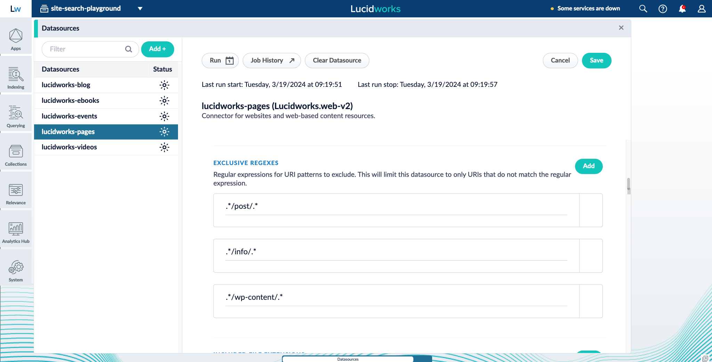

<link rel="stylesheet" href="/lib/public/global-training.css">

<!-- NOTES

**To-do**

**Useful admonitions**

> [!NOTE]  
> Highlights information that users should take into account, even when skimming.

> [!TIP]
> Optional information to help a user be more successful.

> [!IMPORTANT]  
> Crucial information necessary for users to succeed.

> [!WARNING]  
> Critical content demanding immediate user attention due to potential risks.

> [!CAUTION]
> Negative potential consequences of an action.

**Images** 

-->
> Some text about whatever just about long enough now. 
{:.note}

> Some text about whatever just about long enough now. 
{:.tip}

> Some text about whatever just about long enough now. 
{:.important}

> Some text about whatever just about long enough now. 
{:.caution}

> Some text about whatever just about long enough now. 
{:.warning}

## About this playground

This playground environment provides a controlled and secure platform to explore and experiment with a pre-configured Fusion application. The application is specifically designed for site search functionalities and is populated with diverse datasets, offering users a rich sandbox for testing and learning.

It is a basic implementation and serves as an excellent introduction to Fusion and its core features. 

### Datasources

1. **Pages.** Core Lucidworks website content containing informative sections about the Lucidworks' purpose, services, or general information.
1. **Blog.** Regularly updated articles or posts covering a broad range of industry-related topics, news, or insights.
1. **E-books.** Downloadable publications offering in-depth information or guides on specific industry-related subjects.
1. **Events.** Information about gatherings, conferences, workshops, or other occurrences related to our industry, both past, present, and future.
1. **Videos.** Visual content covering informative presentations, demonstrations, or discussions on industry-specific topics.

### What you can do

In this secure application, you have the ability to:

* Create, modify, and delete index and query pipeline stages.
* Work in the Query Workbench. 
* Use the rules editor to create business rules, synonyms, misspelling corrections, and more. 
* Play with Experience Optimizer to curate your ideal search experience.
* Access most Fusion features and functionality, even when not pre-configured for this playground. 

## Things to try

### Explore the data

#### Datasources

Each datasource is set up in a similar way, but there are some key differences. For example, some datasources have unique values declared in **Exclusive regexes**.

> In many cases, key datasource configurations can be found in the advanced view. Toggle **Advanced** on to view these settings. 
{:.tip}

#### Index pipelines

Each datasource is pointed to a unique index pipeline, following a predictable naming pattern. For example, the blog datasource points to an index pipeline called `data-lucidworks-blog`.

Navigate to **Indexing > Index pipelines**, then choose one of the `data-lucidworks-DATA_TYPE` pipelines. 

Note that they all have **Call pipeline** stages called "Intake" and "Outtake." By routing data through these separate, shared index pipelines, Fusion ensures that the data is processed the same at certain phases of indexing. This avoids the need to duplicate work across multiple index pipelines. 

> You can use a **Call pipeline** query pipeline stage for similar purposes.
{:.tip}

#### Query pipeline

Head to the Query Workbench by navigating to **Querying > Query Workbench**.

From here, you can enter a query and view the results. Try turning stages on and off, then investigate what changed in the results. You can also customize the facets in this view.

### Create signals

In the Query Workbench, you can enable click signals to see how clicking on results affects the document's score (relevancy) and position within the results. 

Click **Format Results**, select the **Send click signals** checkbox, and save your change. If you want to generate many signals at once, select the **Show signals generator** checkbox, and a simulate option appears when hold the pointer over a result.

### Create business rules

Navigate to **Relevance > Rules**, to reach the rules editor. Make sure you're on the **Rules** screen, then start creating rules by clicking the **Add** button. 

Some examples are already set up for you. 

> You can test these rules in Experience Optimizer. View the condition and the action of a rule. Replicate the condition in Experience Optimizer, and the action will fire. 
{:.tip}

### Create rewrites

Navigate to the **Rewrites** screen. Explore some of the rewrites that are already set up for you, such as misspelling and synonyms. 

Add new rewrites, modify the existing ones, or delete everything to start over.

### Play with Experience Optimizer

Now that you've created some business rules and rewrites, navigate to Experience Optimizer to see how to create them from a natural search experience. 

> Click the **Start task** button, if you want to start curating the search experience. 
{:.tip}

Begin by entering a search term in the search box. From the results list, you can choose to block a document from appearing, pin a document in its current position, bury a document lower in the result, or boost a document higher in the result. If you want to pin a document in a specific position, you can drag it where you want it.

<iframe src="https://app.supademo.com/embed/ft9Rms9EBaqQFnduqRt5P" allow="clipboard-write" frameborder="0" webkitallowfullscreen="true" mozallowfullscreen="true" allowfullscreen style="position: absolute; top: 0; left: 0; width: 100%; height: 100%;" data-external="1"></iframe>

Rules are created automatically from your interactions, and they are available to edit, delete, or publish in the **Rules** screen.

To create query rewrites, enter a search term in the search box, and click the **Add** button that appears next to the term. Select any of the query rewrite options to create a new query rewrite. 

<iframe src="https://app.supademo.com/embed/V82C_bR_syCuDPuK48-PB" allow="clipboard-write" frameborder="0" webkitallowfullscreen="true" mozallowfullscreen="true" allowfullscreen style="position: absolute; top: 0; left: 0; width: 100%; height: 100%;"></iframe>

Like rules, query rewrites you create in Experience Optimizer are available in the **Rewrites** screen.

## Challenges

These challenges are meant to be open-ended. How you solve the challenge is entirely up to you. If you're stuck, check the [Lucidworks documentation](https://doc.lucidworks.com/). 

### Create your own landing template

Templates help control the look and feel of Experience Optimizer, allowing you to design, test, and implement a wide variety of search experiences.

In Experience Optimizer, you can create a custom landing template popular with new or existing zones. 

### Configure triggers for a template

You can trigger a template in Experience Optimizer based on conditions such as a time range, specific searches, or the URL context. If the required conditions are met, the template will load instead of the default, giving you fine-tuned control over the zone setup and layout. 

### Resolve conflicting rules

The rules editor automatically detects rules that may conflict with each other. In the business rules screen, you'll find several. 

Fix the rules to resolve the warnings.

### Start working with tags

Tags are useful for applying rules when for a specific template zone. This advanced option is configured in the Templates screen. Learn how to incorporate tags in your application. 

## What's next?

The site search playground is designed for you to continue exploring. Try building new functionalities, delve into the data flow within Fusion, and see how you can craft the perfect search experience. 

If you're ready to move on, we recommend the following resources: 

* [Index and query profiles](https://academy.lucidworks.com/index-and-query-profiles)
* [Exploring your data](https://academy.lucidworks.com/path/exploring-your-data)
* [Experience Optimizer learning path](https://academy.lucidworks.com/path/experience-optimizer-learning-path)
* [Query fine-tuning](https://academy.lucidworks.com/path/query-fine-tuning)
* [Lucidworks documentation](https://doc.lucidworks.com/)